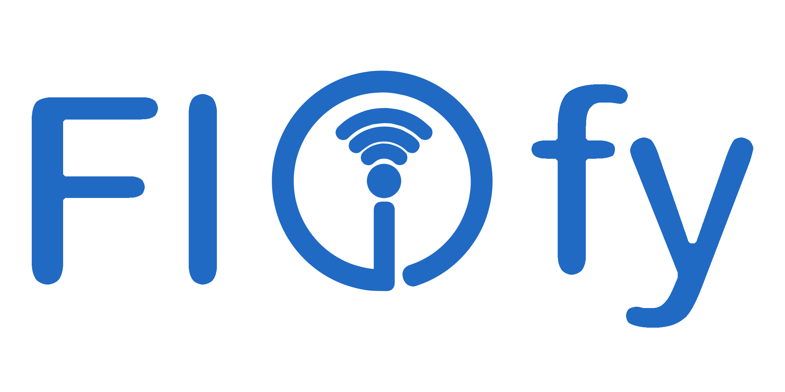
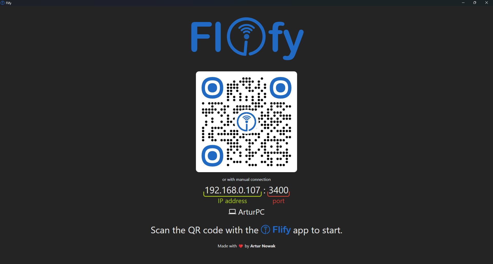
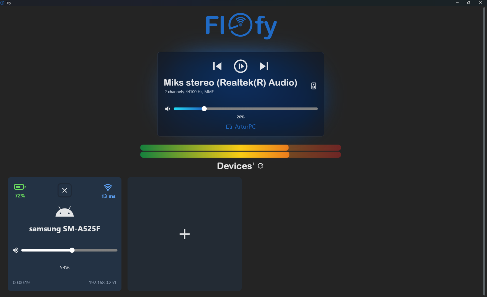
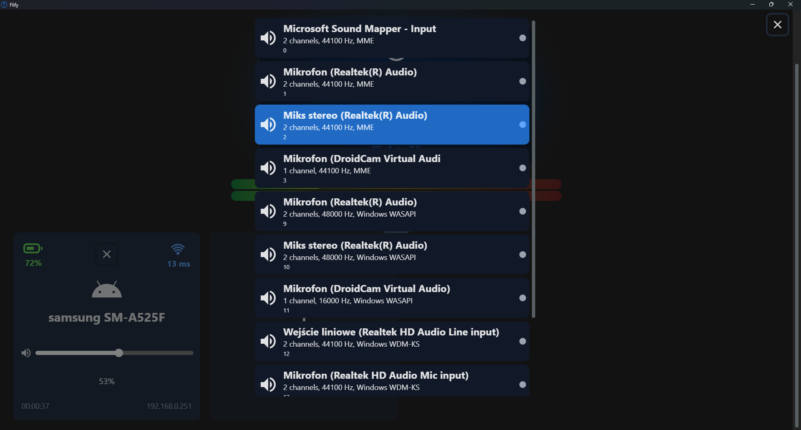
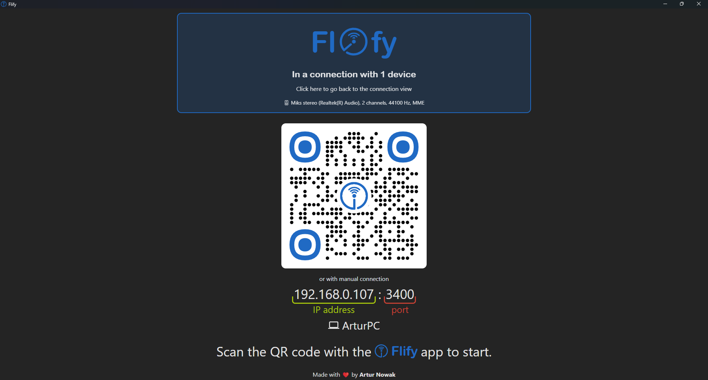
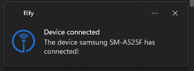
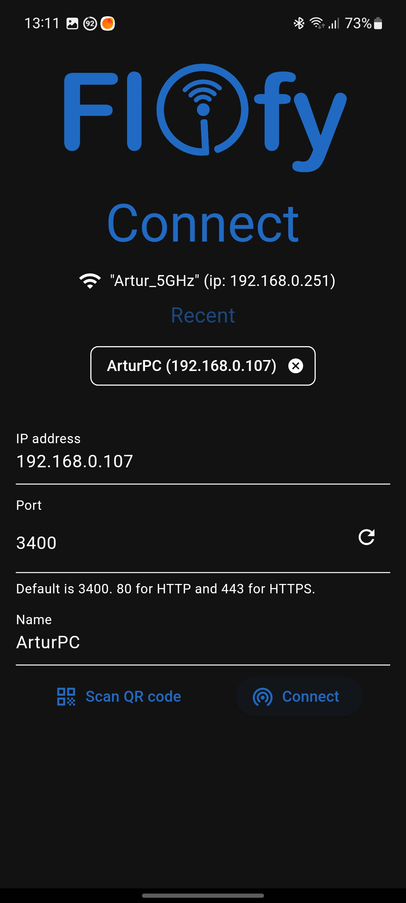
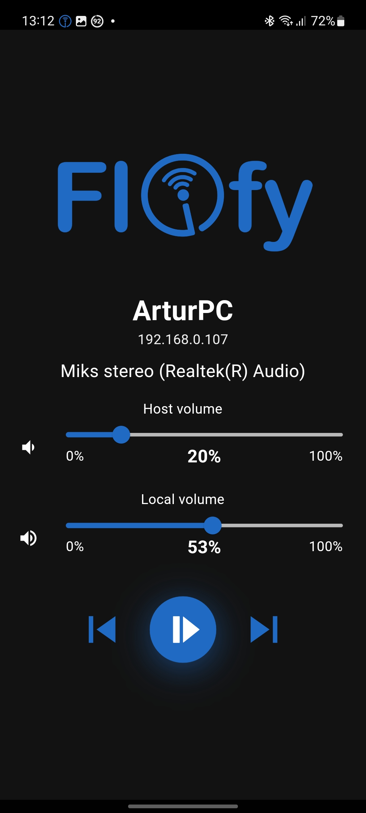
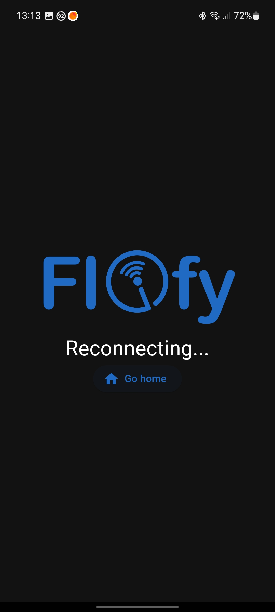
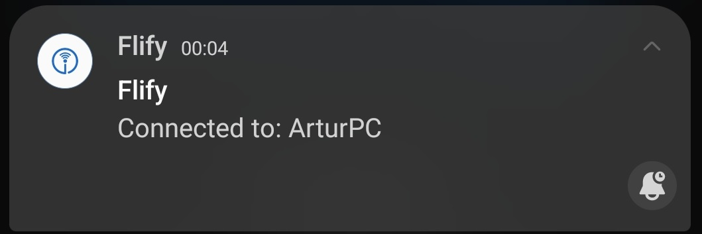

<div align="center">
    
</div>

### Stream PC audio or microphone to mobile easily, in the blink of an eye. You're on your PC that doesn't have Bluetooth and you want to use your portable speaker? Use this app. Or even if your computer has Bluetooth, it is limited in range of usability - want to extend your area of music as much as you like? This app is a perfect fit.

Made with [Electron](https://www.electronjs.org/), [React](https://react.dev/), [Flutter](https://flutter.dev/), [naudiodon](https://www.npmjs.com/package/naudiodon) (PortAudio wrapper for Node.js, it doesn't require having PortAudio on the machine) and... my own [easy-volume library](https://github.com/Arciiix/easy-volume).

# Features

## Desktop app








## Mobile app






🎧 **Send audio from any host audio device** (could be speakers, microphone, etc.) to the Flify mobile app

👥 **Multi-device support** - connect multiple mobile devices to Flify simultaneously for a synchronized audio experience

🎶 **Control the audio playback** from either mobile and desktop - **volume** (both mobile and desktop), **previous track**, **next track**, **pause/play**

🔗 **Trivially simple connection system** - you just scan the QR code or manually copy the **IP address** with the **port** (all is shown on the screen)

🔄 **Intelligent reconnection system** - to prevent random breaks in audio delivery or connection problems

📡 **Reconnection of all devices** - to ensure the lowest latency possible

📊 **Real-time connection status** - stay informed about the network connection quality with all the devices and their state - **ping**, **battery level**

🔊 **High-quality audio streaming** - experience crystal-clear sound

🎨 **Modern, smooth, animated, and user-friendly design** with quick setup - start streaming audio within seconds


> NOTE: On the default Android settings, the mobile app may be automatically closed by the app manager due to it being in the background. To fix that, please [change the battery settings for the app](https://dontkillmyapp.com/).

# Run
See the **Releases** tab. 
Download the latest desktop app - either the installer or the unpacked version - and the latest mobile app.

The app will work out-of-the-box.

# Build
If you want to build the app by yourself, follow the instructions:

## Build desktop app
Requires [Node.js](https://nodejs.org/en) to be installed on your machine.

Developed on Node.js v18.13.0.

```bash
cd desktop
npm install

npm run build
```
Your app will be built in two ways:
* As a standalone, unpacked app - in ```desktop/dist/win-unpacked```
* As a installer - in ```desktop/dist/Flify Setup <version>.exe```


## Build mobile app
Requires [Flutter](https://flutter.dev/) to be installed on your machine.

Developed on Flutter 3.10.5 and Dart 3.0.5.

```bash
cd mobile

flutter pub get

flutter build apk --split-per-abi
# or
flutter build apk # results in a heavy APK that contains the code compiled for all the target ABIs, not preferred

```


Made with ❤️ by [Artur Nowak](https://github.com/Arciiix)